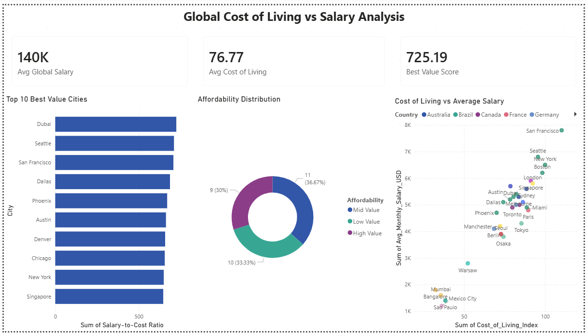

# 🌍 Cost of Living vs Salary Analysis

## Project Overview
Analyzed cost of living and average salary data across 30 global cities 
to identify the best value cities for professionals worldwide.

## Tools Used
- Excel (Data Cleaning & Analysis)
- Power BI (Interactive Dashboard)

## Key Insights
- Dubai and Seattle offer the highest Salary-to-Cost ratio globally
- San Francisco has the highest salary but also highest cost of living
- Average global salary across 30 cities is $4,670/month

## Files
- `cost_of_living_vs_salary.csv` - Raw dataset
- `Cost_of_Living_Analysis.pbix` - Power BI Dashboard

## Dashboard Preview

